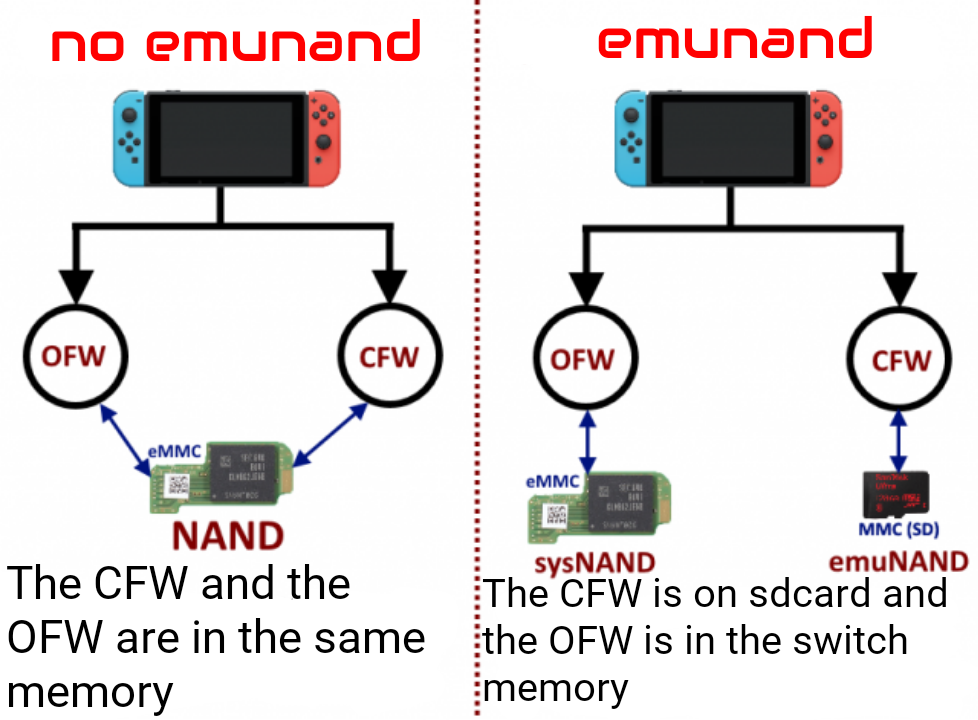

# TF-OS
A new CFW (Pack) for Nintendo Switch. 

Latest compatible firmware: `19.0.0`

Our CFW (Pack) is verry complete with some of homebrews. 

➡ In no event shall we be held responsible for any issues or bricking occurring with your console. We strongly recommend following the provided instructions. 

# Homebrews
This is the list of homebrews on our CFW:

* Installer:

- appstore

- Goldleaf 

- Awoo installer

- Dbi

- Gamecard installer 

* Dumping tools:

- NX Dump tool 

- Firmware dumper

* Overclocking:

- sys clk manager 

- sys clk editor

* File manager:

- NX Shell 

* Mods: 

- SimpleModManager 

* Save editors:

- Checkpoint 

* Firmware updater:

- Daybreak 

- AIO Switch Updater

* Other: 

- Browser (Switch browser) 

- Haze (Pc to sd card file transferer) 

- EdiZon (Cheat Manager)

- NX theme installer 

- sys dvr (Switch game to pc for steaming with obs or other)

- 90DNS setter

- 90DNS tester

- reboot_to_rcm 

- reboot Payload 

- Reset parental control

- Payload Launcher

# Setup
1- Download the last release or Pre release 

2- Format your sd card on `fat32` or `exFAT` and extract contenent of `"sd"` folder on your sd card. Or just drop files in the sd card if you dont want to format it

3- Put your console into RCM mode or `just power on it if your console have a mod chip`

4- (if you are on RCM mode) Start your computer, download and launch `"TegraRCMgui"` go to `tegrarcmgui settings` and `install drivers`, connect your switch at your pc with a cable `can transfer data`, and,if the program show your console is in RCM mode, select the Payload `"hekate..." or "TF PrismaLoader..."` is in the archive with the folder icon and select "inject payload" 

5- Create an emuNAND

Go on hekate and:
Select `"emuMMC"`, `"create emuMMC"`, `"Sd file"` and wait (can be take over 10min)

6- Launch: 

Return at Hekate menu and select "Launch" and select the emuNAND ("emuMMC"),activate airplaine mode immediatly and open the album or launch game with "R" button pressed to launch the homebrew menu. (The album launch the hbmenu in appelt mode and a game with "R" button pressed launch hbmenu in normal mode) 

Note: You must launch Homebrews menu with a game and "R" button pressed to use "Checkpoint" 

# Activate 90DNS `(Optional and at your own riks)` 

Open console settings and connect to internet, go to homebrews menu and launch "90dns setter", when it is finish, launch "90dns tester" and test the 90dns. 

# WARNING 
***IF YOUR SWITCH HAVE A MOD CHIP, PLEASE, NEVER ACTIVATE AUTO RCM ! THIS AUTOMATICLY BRICK YOUR DEVICE !***

# Troubleshooting
- Unable to use `sys-clk manager`:
1. Open hbmenu from album applet or game with "R" hold
2. Open "sys-clk editor" and activate sys-clk
3. Re-try to open sys-clk manager
4. If you're not able to open it, please open an issue
